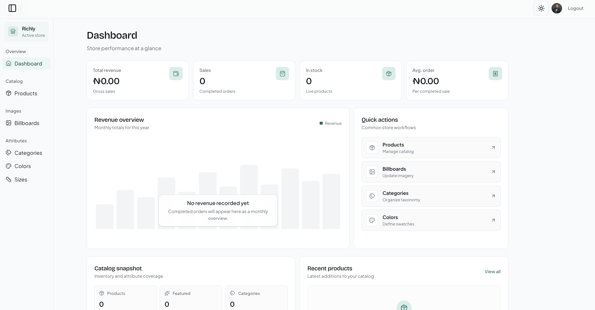
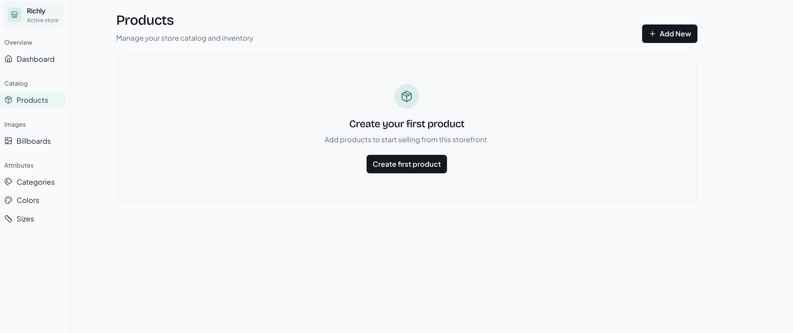
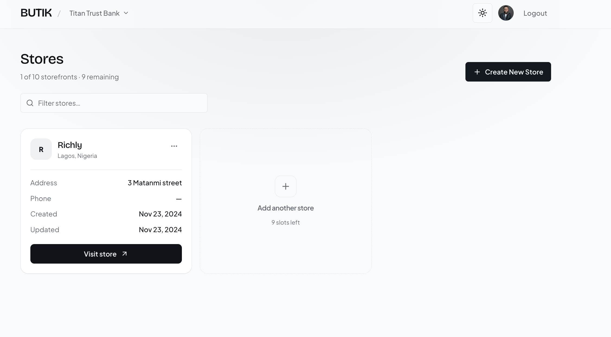

# Butik

Multi-vendor ecommerce admin dashboard. Merchants register a business, create one or more storefronts, manage catalog data, and consume store-scoped REST APIs from their own storefront clients.







## Features

- **Business onboarding** — Authenticated users register a business and manage profile details
- **Multi-store management** — Create and switch between multiple stores under one business (configurable store limit)
- **Catalog admin** — Products, categories, colors, sizes, and billboards per store
- **Store-scoped APIs** — Versioned REST endpoints (`/v1`) keyed by `storeId` for external storefronts
- **Media uploads** — Cloudinary-backed image upload for products and billboards
- **Dashboard overview** — Store metrics and charts for quick ops visibility
- **Auth** — Kinde-powered login / logout with post-login business registration flow

## Tech stack

| Layer | Choice |
| --- | --- |
| Framework | [Next.js](https://nextjs.org/) 16 (App Router) |
| Language | TypeScript |
| UI | React 19, Tailwind CSS 4, Radix UI, shadcn-style components |
| Auth | [Kinde Auth](https://kinde.com/) |
| Database | PostgreSQL via [Neon](https://neon.tech/) |
| ORM | [Prisma](https://www.prisma.io/) 7 |
| State | Redux Toolkit |
| Forms / validation | React Hook Form, Zod |
| Tables / charts | TanStack Table, Recharts |
| Media | Cloudinary (`next-cloudinary`) |

## Project structure

```text
src/
  app/
    api/                  # REST route handlers (business + store resources)
    business/[businessId] # Business-level store list & management
    register-business/    # Post-auth business registration
    store/[storeId]/      # Per-store admin (dashboard, catalog, attributes)
    _components/          # Marketing / landing UI
  components/             # Shared UI (sidebar, tables, modals, etc.)
  lib/                    # Prisma client, helpers, store limits
  reduxStore/             # Client state
  static-data/            # Navigation and static config
prisma/
  schema.prisma           # Data model
  migrations/             # SQL migrations
```

## Prerequisites

- Node.js 20+ (recommended)
- npm, yarn, pnpm, or bun
- A PostgreSQL database (Neon or any Postgres provider)
- [Kinde](https://kinde.com/) application credentials
- [Cloudinary](https://cloudinary.com/) cloud name + upload preset

## Environment variables

Copy `.env.example` and fill in values (create a local `.env`):

```bash
cp .env.example .env
```

| Variable | Description |
| --- | --- |
| `DATABASE_URL` | Pooled Postgres connection string (app runtime) |
| `DIRECT_URL` | Direct Postgres URL (Prisma migrations / schema tools) |
| `KINDE_CLIENT_ID` | Kinde application client ID |
| `KINDE_CLIENT_SECRET` | Kinde application client secret |
| `KINDE_ISSUER_URL` | Kinde issuer URL (e.g. `https://<subdomain>.kinde.com`) |
| `KINDE_SITE_URL` | App base URL (e.g. `http://localhost:3000`) |
| `KINDE_POST_LOGIN_REDIRECT_URL` | Redirect after login (typically `/register-business`) |
| `KINDE_POST_LOGOUT_REDIRECT_URL` | Redirect after logout |
| `NEXT_PUBLIC_URL` | Public app URL |
| `NEXT_PUBLIC_CLOUDINARY_CLOUD_NAME` | Cloudinary cloud name |
| `NEXT_PUBLIC_CLOUDINARY_PRESET` | Cloudinary unsigned upload preset |
| `NEXT_PUBLIC_MAX_STORES` | Max stores per business (default `10`) |


## Getting started

Install dependencies:

```bash
npm install
```

Apply database migrations:

```bash
npx prisma migrate deploy
# or, during local development:
npx prisma migrate dev
```

Generate the Prisma client (if needed):

```bash
npx prisma generate
```

Start the development server:

```bash
npm run dev
```

Open [http://localhost:3000](http://localhost:3000).

### Scripts

| Command | Description |
| --- | --- |
| `npm run dev` | Start Next.js in development mode |
| `npm run build` | Create a production build |
| `npm run start` | Serve the production build |
| `npm run lint` | Run Next.js ESLint |

## Domain model (high level)

```text
User ──1:1── Business ──1:N── Store
                                ├── Products
                                ├── Categories
                                ├── Colors
                                ├── Sizes
                                ├── Billboards
                                └── Orders
```

Each store has its own catalog and a unique API surface under `/api/[storeId]/.../v1`.

## API overview

Authenticated business routes:

| Method | Path | Purpose |
| --- | --- | --- |
| `POST` | `/api/business/v1` | Create a business |
| `GET` / `PATCH` | `/api/business/[businessId]/v1` | Read / update business |
| `GET` / `POST` | `/api/business/[businessId]/stores/v1` | List / create stores |
| `GET` / `PATCH` / `DELETE` | `/api/business/[businessId]/stores/[storeId]/v1` | Store CRUD |

Store resource routes (examples):

| Resource | Collection | Item |
| --- | --- | --- |
| Products | `/api/[storeId]/products/v1` | `/api/[storeId]/products/[productId]/v1` |
| Categories | `/api/[storeId]/categories/v1` | `/api/[storeId]/categories/[categoryId]/v1` |
| Colors | `/api/[storeId]/colors/v1` | `/api/[storeId]/colors/[colorId]/v1` |
| Sizes | `/api/[storeId]/sizes/v1` | `/api/[storeId]/sizes/[sizeId]/v1` |
| Billboards | `/api/[storeId]/billboard/v1` | `/api/[storeId]/billboard/[billboardId]/v1` |

Auth callbacks are handled at `/api/auth/[kindeAuth]`.

## Typical workflow

1. Sign in with Kinde
2. Register a business (`/register-business`)
3. Create one or more stores under `/business/[businessId]`
4. Open a store admin (`/store/[storeId]/dashboard`)
5. Configure billboards, categories, colors, sizes, and products
6. Point a storefront client at the store’s `/api/[storeId]/.../v1` endpoints

## Deployment

Deploy like any Next.js App Router app (Vercel, Railway, etc.):

1. Set all environment variables in the host
2. Point `DATABASE_URL` / `DIRECT_URL` at your Postgres instance
3. Run migrations (`npx prisma migrate deploy`) as part of release
4. Build and start (`npm run build` → `npm run start`), or use the platform’s Next.js adapter
5. Align Kinde redirect URLs with the production origin

This repository is the open-source / portfolio edition of UseButik, a multi-tenant commerce platform.

Licensed under the MIT License. 
